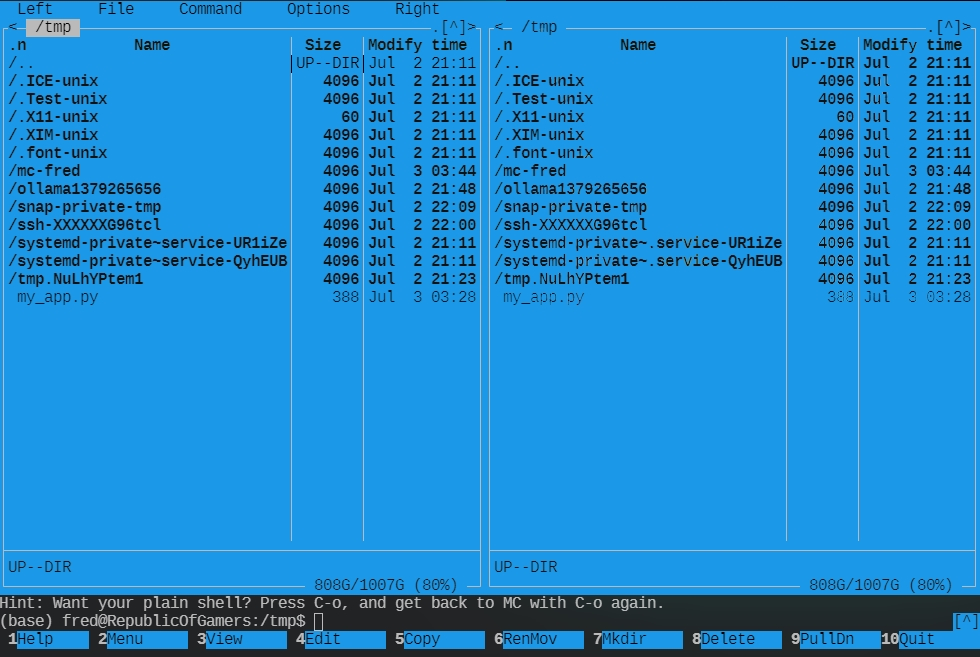

layout: page
title: "What is a TUI?"
permalink: /Docs/TUI/what-is-yui

# What is a TUI?



A TUI is a type of user interface that relies solely on text-based input and output. Unlike
graphical user interfaces (GUIs), TUIs don't use windows, icons, or visual elements. They
present information and interact with users through plain text commands, menus, and structured
data displays.

## Why Develop TUIs?

* **Simplicity:** TUIs are often easier to implement than GUIs, requiring less complex software
and resources.
* **Portability:** They work across a wide range of operating systems and hardware
configurations, as they don't rely on specific graphical libraries.
* **Accessibility:** TUIs can be more accessible for users with visual impairments or those
using assistive technologies.
* **Efficiency:** For tasks involving large amounts of text data or command-line operations,
TUIs can be highly efficient.

## Key Concepts in TUI Development

1. **Terminal Emulators:**  TUIs are displayed and interacted with using terminal emulators
(xterm, konsole, terminator, guake, iTerm2, etc.). These provide a text-based console window.

1. **Text Formatting:**
   * **ANSI Escape Codes:** These special sequences control text color, style (bold, underline),
cursor positioning, and more.
   * **Libraries:** Some languages offer libraries for easier text formatting (e.g., `ncurses`
in C, `rich` in Python).

1. **Input Handling:** TUIs typically read user input line by line using functions like `read()`
or `getline()`.

1. **Output Generation:**  Structure your text output clearly using indentation, line breaks,
and formatting to enhance readability.

1. **Menu Systems:**  Create interactive menus using numbered options and conditional statements
to guide users through your TUI.

1. **Data Display:**  Present data in tables, lists, or other structured formats for easy
comprehension.

## Popular TUI Libraries and Tools

* **ncurses (C):** A powerful and widely used library for creating interactive TUIs.
* **readline (C):** Provides advanced input handling features, such as command history and
auto-completion.
* **Tkinter (Python):**  While primarily a GUI toolkit, Tkinter has limited TUI capabilities.
* **rich (Python):** A modern library for rich text formatting and interactive console
applications.
* **prompt_toolkit (Python):**  Offers a flexible and extensible framework for building
interactive command-line interfaces.

## Example (Python with `rich`)

```python
from rich import print
from rich.console import Console

console = Console()

print("\n\n**********************************************************\n")
print("[bold green]Hello[/] from the TUI!")
print("This is a simple example using the `rich` library.")

name = input("What's your name? ")
console.print(f"Welcome, {name}!\n\n************************************************************\n")
```

## What's next?

1. **Choose a Language:** Python, C, or other languages with suitable libraries.
2. **Select a Library:** Based on your needs and preferences.
3. **Experiment:** Start with simple examples and gradually build more complex TUIs.
