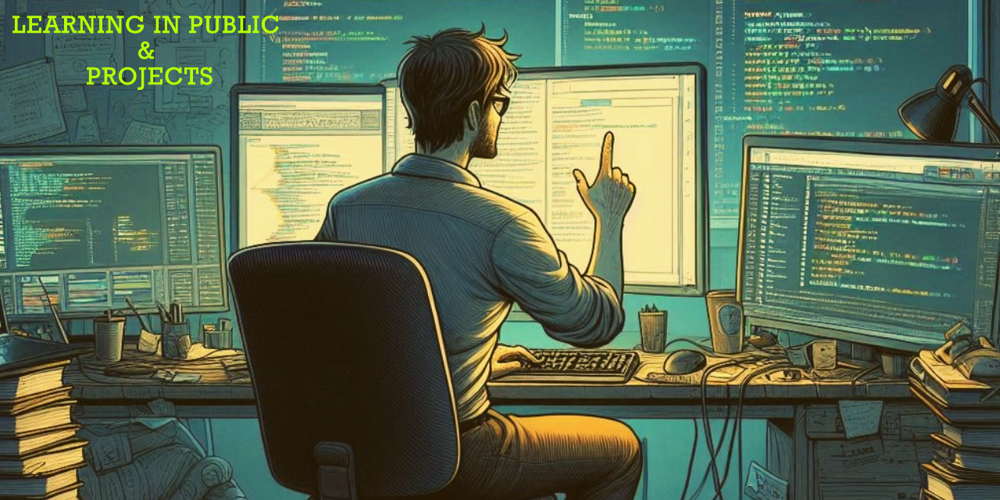

---
# Feel free to add content and custom Front Matter to this file.
# To modify the layout, see https://jekyllrb.com/docs/themes/#overriding-theme-defaults

layout: home
---

## what is this?

> Hi!, Here I will compile my notes, projects and other stuff.
> I will also be uploading some of my projects to this website.

### $ whoami

I'm a 39-year-old self-taught IT and cybersecurity enthusiast. I'm passionate about technology and its potential to transform the world. I'm constantly seeking new challenges and opportunities to learn and grow.

I'm actively building my skills and knowledge base, aiming to transition from my current career in structural steel fabrication into the IT and cybersecurity field. Despite never having worked professionally in IT or cybersecurity, I'm driven by a deep passion for technology and a desire to challenge myself.
Currently, I work in logistics management and fabrication at a structural steel factory. However, I don't want to finish my career regretting not having given myself a shot at becoming a professional in the IT field. While traditional schooling hasn't been my strong suit, I've been a lifelong self-learner, constantly teaching myself various subjects that ignite my curiosity.
I thrive on hands-on learning, embracing a cycle of reading, trying, failing, taking notes, and repeating until I master a skill. My stubborn nature and persistence serve me well when tackling challenging tasks. It's not about bragging rights - in fact, most of my friends have no idea what I do in my spare time. Instead, it's the personal reward of success after struggling that drives me forward in this journey of continuous learning and growth in the tech world.

### Key points about me

- I'm actively engaged in cybersecurity challenges on platforms like TryHackMe and HackTheBox, constantly pushing my skills to new levels.
- I pursue continuous learning through courses on platforms like AWS Skills, Microsoft Learn, and Cybrary, etc. always seeking to expand my knowledge base.
- My experience with web development dates back to age 13 when I created my first websites using just Notepad.
- I have a keen interest in AI, including AI art generation, and I'm constantly exploring its various applications.
- I'm a dedicated note-taker, having compiled over 1500 pages of cybersecurity knowledge in my personal digital vault.
- Currently, I'm focused on *Python programming*, *Open Sources LLMs models(Ollama)* and *Machine Learning*.
- I'm particularly excited about exploring the intersection of *AI* and *cybersecurity* as a potential career path.

### Connect with me

If you'd like to connect or follow my journey, you can find me on X [@TheRealFREDP3D](https://x.com/TheRealFredP3D), where I share my latest projects and insights into the world of technology and cybersecurity.

I'm always eager to learn and collaborate, so feel free to reach out!
---
